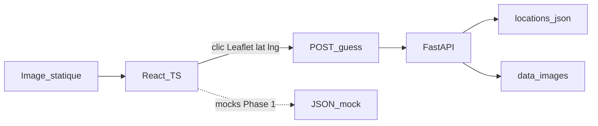

# Architecture — TP React Groupe 3

Décisions de **Phase 0**. Ce document est la référence du groupe. Les features de jeu ne sont pas implémentées ici.

## Combo retenu

| Sujet | Choix | Écarté |
|---|---|---|
| Dépôt | Monorepo `frontend/` + `backend/` + `docs/` | Deux repos |
| Frontend | Features `game` / `map` / `result` | Feature-Sliced Design, Redux |
| Backend | FastAPI plat (routers + services) | Architecture hexagonale |
| État de partie | API **stateless** (un round isolé) ; 5 manches côté React | Session serveur dès le MVP |
| Intégration | Contrat OpenAPI figé + mocks | Coder sans contrat |
| Carte | Leaflet + OpenStreetMap via react-leaflet | Carte maison, Google Maps, Mapbox |
| Photos | Fichiers dans `backend/app/data/images/` | Street View, API externe, `frontend/public` |

## Contraintes respectées

- Personne 1 (UI jeu) et personne 2 (carte) avancent avec des **mocks**, sans attendre le backend.
- Personne 3 (FastAPI) et personne 4 (données) avancent **sans le frontend**.
- Personne 5 écrit des tests dès que le contrat JSON est figé.
- Flux MVP : `START → ROUND → GUESS → RESULT → NEXT ROUND` (puis 5 manches).
- La carte n’est **pas** dessinée : Leaflet + tuiles OSM. Les photos sont des fichiers backend.

Papier opérationnel pour le groupe : [CONSIGNES.md](./CONSIGNES.md).



## Organisation du dépôt

```
TP-REACT-GROUPE-3/
  frontend/          # Vite + React + TypeScript
  backend/           # FastAPI
  docs/              # contrat API + architecture
  .github/workflows/ # CI
```

Un seul GitHub : un clone, des PRs visibles par tout le monde, un contrat unique.

## Frontend — par fonctionnalités

```
frontend/src/
  app/               # router, layout, providers
  features/
    game/            # écran manche, timer, score, transitions  → Personne 1
    map/             # Leaflet + OSM, marker, lat/lng          → Personne 2
    result/          # distance + score après guess
  shared/            # client API, types, UI générique, mocks
```

État de partie (MVP) : `useState` / Context dans `features/game`. Pas de Redux.

Les 5 rounds, le score total et le « play again » vivent **côté React**. L’API ne connaît qu’une manche à la fois.

## Backend — routers + services

```
backend/
  app/main.py
  app/routers/rounds.py
  app/services/scoring.py      # distance + score → Personne 3
  app/services/game.py         # création de round
  app/data/locations.json      # métadonnées → Personne 4
  app/data/images/             # jpg servies en /static/locations/ → P4 + P3
  tests/
```

Le serveur mémorise uniquement `roundId → coordonnées réelles` le temps du guess (mémoire process). Il ne stocke pas de partie (`game`) ni de score total.

Les images ne quittent pas le backend : FastAPI les sert via `/static/locations/<fichier>.jpg`. Le champ `imageUrl` du contrat pointe vers cette URL. Pas d’images dans `frontend/public`.

## Contrat API

Source de vérité : [openapi.yaml](./openapi.yaml) (lisible : [api.md](./api.md)).

Règle d’or : **ne jamais renvoyer latitude / longitude avant le guess**.

## Branches

Voir [CONTRIBUTING.md](../CONTRIBUTING.md).
