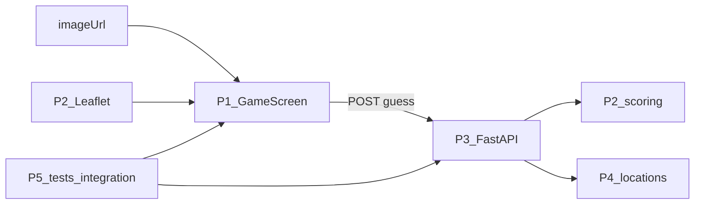

# Architecture — TP React Groupe 3

Une app GeoGuessr-like. **Même 5 personnes** sur le front et le back (un dossier chacun). Contrat : [api.md](./api.md). Papier : [CONSIGNES.md](./CONSIGNES.md).

## Combo

| Sujet | Choix | Écarté |
|---|---|---|
| Dépôt | Monorepo `frontend/` + `backend/` + `docs/` | Deux repos |
| Front | Features `game` / `map` + `shared/api` | FSD, Redux |
| Back | 5 fichiers/dossiers, une seule API | Hexagonale, 5 APIs |
| Partie | API stateless ; 5 manches côté React | `POST /games` au MVP |
| Carte | Leaflet + OSM | Carte maison, Google, Mapbox |
| Photos | `backend/app/data/images/` | Street View, `frontend/public` |



## Front

```
frontend/src/
  app/                      # P5 — coller le tout
  features/game/            # P1 — start, timer, 5 rounds, score, Guess
  features/map/             # P2 — Leaflet, clic, markers
  features/result/          # P1 — distance + score après guess
  shared/api/               # P3 — getRound / postGuess + mocks
```

5 manches + score total = React. Pas de Redux.

## Back

```
backend/app/
  schemas.py                # P1 — Pydantic = JSON du contrat
  services/scoring.py       # P2 — Haversine + score
  services/game.py          # P3 — roundId en mémoire
  routers/rounds.py         # P3 — GET /api/round, POST .../guess
  data/locations.json       # P4
  data/images/              # P4 — servies en /static/locations/
tests/                      # P5
```

Une API seulement. **Jamais** lat/lng dans le GET.

## Branches

`main` → `dev` → `P1` … `P5`. Voir [CONTRIBUTING.md](../CONTRIBUTING.md).
